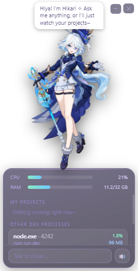

# Hikari — anime desktop companion

A small always-on-top Electron widget that lives in the corner of your desktop, watches over your dev projects, and chats with you.

<p align="center">
  
</p>

## What she does

- **Watches your projects** — polls running processes and groups them by project (name, CPU %, RAM, process count), plus overall system CPU/RAM. Define your project list in `config.local.json` (see below); anything unmatched shows under "other dev processes".
- **Chats** — type in the box and she replies in a speech bubble. Her brain is the local [Claude Code](https://claude.com/claude-code) CLI (`claude -p`), so there are no API keys in this repo; if you have Claude Code installed and logged in, she just works.
- **Speaks** — replies are read aloud with Microsoft Edge neural TTS voices via [msedge-tts](https://www.npmjs.com/package/msedge-tts). Free, no account needed.

## Running

```
npm install
npm start
```

or double-click `Hikari.bat` on Windows.

## Configuration

`config.json`:

| Key | Default | Meaning |
|---|---|---|
| `voice` | `en-US-AnaNeural` | Any Edge TTS voice name |
| `pitch` | `+15Hz` | Voice pitch offset |
| `rate` | `+6%` | Speaking rate offset |
| `model` | `haiku` | Model passed to `claude --model` |
| `speakGreeting` | `true` | Say hello on launch |
| `persona` | `null` | Custom persona prompt (null = built-in default) |
| `projects` | `[]` | Projects to watch: `[{ "key", "name", "emoji" }]` |

For personal customizations, create a `config.local.json` next to `config.json` — it's gitignored and merged over it, so your persona and project list stay out of version control:

```json
{
  "persona": "You are Hikari, ... (your own prompt)",
  "projects": [
    { "key": "myproject", "name": "My Project", "emoji": "🚀" }
  ]
}
```

`key` is matched as a path segment against process command lines, so use your project's folder name.

## Requirements

- Windows (process watching and TTS are Windows-tested; the widget itself is plain Electron)
- Node 18+
- [Claude Code](https://claude.com/claude-code) CLI installed and authenticated (for chat; stats work without it)

## Character art

The character sprite (`chara.png`) is replaceable — drop in any transparent PNG. The included art is a placeholder and not covered by this repo's licence.
